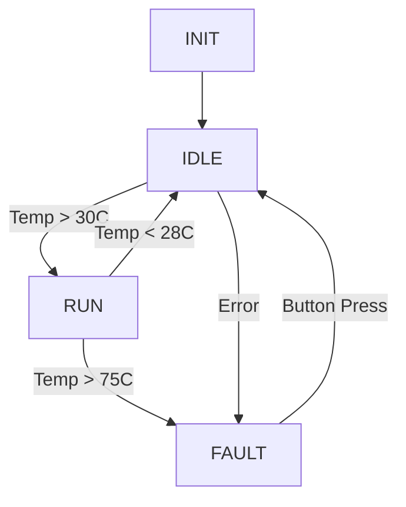

```mermaid
graph TD 
    INIT --> IDLE 
    IDLE -- Temp > 30C --> RUN 
    RUN -- Temp < 28C --> IDLE 
    RUN -- Temp > 75C --> FAULT 
    IDLE -- Error --> FAULT 
    FAULT -- Button Press --> IDLE
```